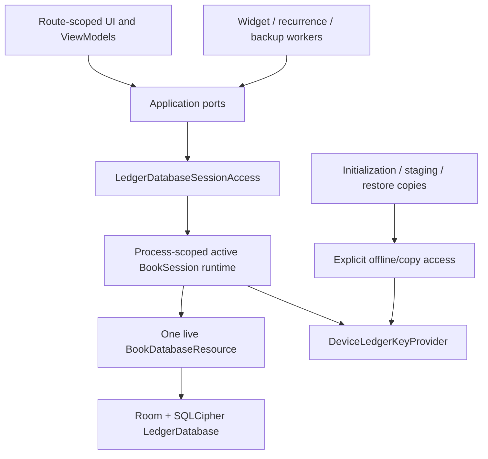

# P37 Interactive Performance Remediation Plan

Last updated: 2026-09-04 (Asia/Tokyo)
Status: VERIFIED — implementation, same-candidate API 28/API 36 evidence, final aggregates and delivery hygiene are complete
Scope: interactive latency, encrypted database lifecycle, data loading, query count, UI state propagation and performance gates

## 1. Executive decision

The primary interactive-latency fault is architectural: `BookSessionManager` opens and retains the live SQLCipher/Room database for the unlocked session, while interactive finance adapters ignore that resource and independently perform `DeviceLedgerKeyProvider.open -> Room/SQLCipher open -> query or mutation -> close` for each port call. One user action commonly invokes several ports, so it repeats Android Keystore unwrap, SQLCipher keying, Room construction, connection hooks and database validation several times before clearing the UI loading state.

P37 will make the unlocked book session the sole owner of the live primary database and provide capability-limited, block-scoped database access to interactive and headless callers. P37 will then remove synchronous full-reference reloads from mutation completion, split oversized snapshots, deduplicate loads, eliminate the journal N+1 path, narrow Compose observation and replace frame-only performance evidence with end-to-end interaction latency gates.

The work must be delivered incrementally. Database reuse and measurement come first. Cache and UI refactors may begin only after the shared database lifecycle is proven correct. No phase may weaken encryption, accounting invariants, application lock behavior, restore isolation or failure atomicity.

## 2. Evidence and current fault model

### 2.1 Confirmed code paths

| Observation | Current evidence | User-visible consequence |
|---|---|---|
| The unlocked session already retains a database resource | `core/security/.../BookSessionManager.kt`: `resource`, `ensureResource()`, `unlockUi()` and `closeIfUnused()` | A reusable connection lifecycle already exists but is not used by business adapters |
| Business adapters unwrap keys and reopen the primary database | `withDatabase` implementations in ordinary, reference, journal, budget, credit, installment, loan, settlement, automation and other secure Room ports | Every application-port call pays Keystore, SQLCipher and Room startup cost |
| Database open performs substantial work | `EncryptedDatabaseFactory.openPrimaryNamed()` constructs Room, installs SQLCipher hooks, WAL, migrations and callbacks; `onOpen` validates secure PRAGMAs | Repeated opens are not equivalent to a cheap pooled query |
| Ordinary save performs multiple opens before pending clears | `saveOrdinaryRecord()` calls `submit()`, then `finishRecordSave()` performs a full reference snapshot and another ordinary snapshot; the latter performs an entry-reference snapshot plus its own open | One save currently requires at least four live-primary open/close cycles |
| Full reference data is used interactively | `loadReferenceData()` and `loadReferenceDataAfterMutation()` call `referenceDataPort.snapshot()` | Startup and mutation completion may read accounts, cards, categories, merchants, places, locations, checkpoints, account transactions and goals |
| Existing target-scale evidence measured the full snapshot at 6,968 ms | `docs/implementation/P35_PERFORMANCE_FAULT_SECURITY_AUDIT.md` | A multi-second spinner is compatible with checked-in evidence, even before repeated opens are added |
| Unlock eagerly starts several loaders | Ready-state collection starts widget, references, record, journal and automation work | Multiple newly opened SQLCipher instances can contend on the same file during startup |
| Navigation destinations start fresh loads | Budget, project/goal, installment, automation, refund, specialized and analysis destinations use `LaunchedEffect` loaders | Existing content is often replaced by `Loading`, producing a spinner on normal navigation |
| Journal paging performs per-row enrichment | `SecureRoomJournalApplicationPort.page()` calls `row()` for each page item and optionally `runningBalance()` per item | A 40-row page performs approximately 41 SQL statements in total, or 81 when per-row running balance is enabled |
| Root Compose scope observes nearly all feature flows | `ReadyRootScaffold` collects reference, record, journal, credit, installment, loan, settlement, automation and other state at the shell | Unrelated state changes recompose a broad UI subtree |
| P35 navigation/save benchmarks do not measure action-to-content duration | Navigation and save cases use frame and memory metrics and wait for text | A long spinner can pass when rendered frames themselves are smooth |

The direct-open inventory currently contains 25 primary/copy access files, including infrastructure helpers. P37 must classify each use; it must not mechanically replace copy, initialization or restore access with an interactive lease.

### 2.2 Current ordinary-save critical path

```text
Save tap
  -> ordinary submit
     -> key unwrap -> open live DB -> transaction -> close
  -> full reference reload
     -> key unwrap -> open live DB -> full snapshot -> close
  -> ordinary entry reload
     -> key unwrap -> open live DB -> entry references -> close
     -> key unwrap -> open live DB -> editor/defaults -> close
  -> clear pending state and finish navigation
```

### 2.3 Target critical path

```text
Unlock book
  -> key unwrap once -> open and inspect live DB once

Save tap
  -> acquire Ready session operation lease
  -> one atomic write on the existing DB
  -> publish authoritative commit/revision/change event
  -> acknowledge save and navigate
  -> refresh only invalidated projections in the background

Lock or switch book
  -> reject new UI operations
  -> cancel stale UI reads
  -> allow an already-entered atomic write to finish or fail atomically
  -> close DB after the final operation/headless lease releases
```

## 3. Objectives, non-goals and permanent constraints

### 3.1 Objectives

1. Open and key the live primary database once per unlocked process session, not once per application-port call.
2. Make navigation and mutation latency observable from user action to authoritative content or commit acknowledgement.
3. Remove the full reference snapshot from startup, ordinary-save completion and other ordinary interactive paths.
4. Preserve usable content while refreshing; use a blocking spinner only when no valid content exists or a genuinely blocking operation is active.
5. Make all cache reuse revision-aware and all asynchronous result publication session- and request-generation-aware.
6. Bound query and row counts for every interactive screen at the target fixture.
7. Preserve all current financial, security, restore, privacy, cryptographic and schema guarantees.

### 3.2 Non-goals

- P37 does not change accounting rules, Journal/Posting/effect semantics, immutable-history policy or projection formulas.
- P37 does not change the SQLCipher algorithm, key hierarchy, Keystore authentication policy or vault authentication boundary.
- P37 does not require a Room schema version change. Query indexes may be proposed only when `EXPLAIN QUERY PLAN` proves that batching and existing indexes are insufficient; such an index change must be isolated as its own migration.
- P37 does not introduce cloud synchronization, remote telemetry, arbitrary analytics collection or plaintext performance logging.
- P37 does not make import, restore, merge, backup-copy creation or migration appear instant. Those remain explicit long operations with progress and exclusive lifecycle rules.
- P37 does not use optimistic client-side arithmetic as an authoritative balance or financial projection.

### 3.3 Non-negotiable invariants

| Area | Required invariant |
|---|---|
| Key material | No Port, ViewModel, Composable, cache or trace receives or retains the database passphrase. Key bytes remain confined to the resource-opening boundary and are zeroized according to the existing key APIs. |
| Live database ownership | Exactly one process-scoped owner may open the selected live-primary database for normal UI/headless access. |
| Lock behavior | Once the state becomes `Locked`, no new UI read or write can acquire access and no stale result can be published to the locked/new session. |
| Atomic writes | An in-flight transaction is never interrupted in a way that can produce partial facts or projections. It completes atomically or rolls back before the resource closes. |
| Write ordering | All live-ledger writes share one process-wide ordering boundary. Per-Port mutexes must not remain the only cross-feature synchronization. |
| Book isolation | A lease captured for book A or generation N cannot access book B or generation N+1. |
| Maintenance | Restore, merge, primary-file replacement, projection rebuild and other exclusive work cannot overlap ordinary UI database use. |
| Headless capabilities | Widget, recurrence, backup read and maintenance tasks retain explicit capability checks; a headless lease is not a generic bypass around session state. |
| Cache correctness | An event may trigger refresh, but event delivery alone is never the correctness mechanism. Cached values must be tagged with book and authoritative revision and rejected when mismatched. |
| UI acknowledgement | Financial success is shown only after the authoritative database transaction commits. Background projection reads may follow, but the UI must not announce an uncommitted write. |
| Failure mapping | Session denial, generation expiry, database failure and domain rejection remain distinguishable and map to sanitized application errors without identifiers or sensitive payloads. |

## 4. Target encrypted-database architecture

### 4.1 Ownership topology



Interactive Ports must depend on `LedgerDatabaseSessionAccess`, not on `Context + DeviceLedgerKeyProvider`. Only the session runtime and explicitly allowlisted offline/copy components may open the live primary database.

### 4.2 Proposed access contract

The exact naming may change during implementation, but the semantics must remain equivalent to this contract:

```kotlin
sealed interface LedgerAccessPurpose {
    data class UiRead(val generation: Long) : LedgerAccessPurpose
    data class UiWrite(val generation: Long) : LedgerAccessPurpose
    data class Headless(val lease: HeadlessBookLease) : LedgerAccessPurpose
    data class ExclusiveMaintenance(val lease: MaintenanceBookLease) : LedgerAccessPurpose
}

interface LedgerDatabaseSessionAccess {
    suspend fun <T> withDatabase(
        bookId: StableId,
        purpose: LedgerAccessPurpose,
        block: suspend (LedgerDatabase) -> T,
    ): T
}
```

Required properties:

- Access is block-scoped. Callers cannot obtain a long-lived database, connection, DAO or passphrase.
- The runtime validates state, book ID, session generation and headless/maintenance capability before incrementing the active-operation count.
- The lifecycle mutex protects state and counters only; it must not be held while arbitrary database work executes.
- `finally` always decrements the operation count, including cancellation and exceptions.
- Resource close is deferred until the UI lease, headless leases and active-operation count are all zero.
- UI writes also pass through a single shared write coordinator. Nested Port calls must reuse an explicit write/database context instead of reacquiring a non-reentrant mutex.
- Results carry the captured session generation. The presentation layer discards results when that generation or the request key is no longer current.

`BookDatabaseResource` currently hides its `LedgerDatabase`. P37 may extend the internal resource with a block-scoped `withDatabase` operation, or move the resource implementation behind the new runtime. It must not expose a public `database` property.

### 4.3 Lifecycle and revocation semantics

| Transition | Required behavior |
|---|---|
| `Locked -> Opening -> Ready` | Unwrap the selected book key once, open once, run startup inspection once, create a new monotonically increasing generation and admit UI access. |
| Ready navigation/read | Acquire an operation lease on the existing resource; never unwrap or reopen. Concurrent reads are permitted within Room/SQLite guarantees. |
| Ready mutation | Validate Ready/book/generation, enter the global write boundary, revalidate before the transaction, commit atomically, then publish a change event. |
| App lock/timeout | Publish `Locked` immediately so sensitive UI disappears, reject new UI operations, cancel session-owned read jobs, wait for active operations to release, then close if no headless lease remains. |
| Lock during an entered write | Do not force-close a connection mid-transaction. Allow the transaction to commit or roll back; suppress stale UI publication; close immediately after release when no lease remains. |
| Headless access while UI is Ready | Share the same resource and increment the headless lease count; do not open a second primary instance. |
| Headless access while UI is Locked | Open once for the first authorized headless lease, inspect as required, share across compatible leases, close after the final lease and operation release. |
| Enter maintenance | Stop admitting UI access, cancel/drain ordinary reads, wait for entered writes, then grant an exclusive maintenance lease. |
| Restore or replace primary file | Require the live resource to be closed before file exchange; reopen and inspect only after replacement completes. |
| Switch book | Revoke the old generation, drain/close its resource, clear all book-scoped caches and only then open the new book. |
| Process death | Rely on normal descriptor/key cleanup; reconstruct state and inspect the database on the next process start. No in-memory cache is authoritative. |

### 4.4 One global write boundary

The current data layer contains separate mutex-backed gates for ordinary, reference, journal, budget, project/goal, credit, installment, loan, settlement, refund, batch and specialized writes. These gates do not serialize writes across Port types.

P37 must introduce one process-scoped `LedgerWriteCoordinator` for the live ledger. It must:

1. serialize top-level writes across all features;
2. recheck session/book/generation after queueing and before entering the transaction;
3. never hold the session lifecycle mutex during the write;
4. support a passed `LedgerWriteContext` for intentional nested orchestration;
5. prohibit nested acquisition of the global non-reentrant gate;
6. retain the existing inside-transaction book head, expected revision, idempotency and invariant checks;
7. emit a committed event only after the repository returns a successful authoritative receipt.

Per-Port gates may be removed only after all callers for that Port use the shared boundary and concurrency tests cover cross-feature writes.

### 4.5 Access classification and migration inventory

#### Interactive live-primary access — migrate to the session runtime

- `SecureRoomReferenceDataManagementPort`
- `SecureRoomOrdinaryTransactionEntryPort`
- `SecureRoomJournalApplicationPort`
- `SecureRoomBudgetApplicationPort`
- `SecureRoomProjectGoalApplicationPort`
- `SecureRoomCreditApplicationPort`
- `SecureRoomInstallmentApplicationPort`
- `SecureRoomLoanApplicationPort`
- `SecureRoomSettlementApplicationPort`
- `SecureRoomAutomationApplicationPort`
- `SecureRoomRefundApplicationPort`
- `SecureRoomBatchEntryApplicationPort`
- `SecureRoomSpecializedTransactionEntryPort`
- `SecureRoomOpeningBalanceWritePort`
- `SecureRoomVaultSecretApplicationPort` for primary-database access only; vault field decryption remains separately authentication-bound
- analytics live-primary access currently supplied through a copied passphrase in `AppDependencyModule`
- live-primary reads/writes in `SecurePrimaryLedgerAccess`

#### Headless live-primary access — migrate through a capability lease

- `SecureRoomWidgetSnapshotApplicationPort`
- recurrence generation/execution
- `SecureRoomLedgerExportQueryPort`
- automatic backup metadata and snapshot reads
- `SecureRoomControlledPurgeApplicationPort`
- projection/trash maintenance

When UI and headless work coexist for the same book, they must share the one process resource. Separate `BookSessionManager` instances for the same live primary are prohibited in the target architecture.

#### Explicit direct/offline/copy access — retain, but isolate and allowlist

- `SecureRoomLedgerInitializationPort`, because the live database does not exist yet;
- import staging databases and opaque ledger copies selected by `SelectedLedgerDatabase`;
- `SecureShadowLedgerAccess` and shadow validation;
- restore/merge input and safety copies;
- primary file replacement during exclusive maintenance, after the live resource is closed;
- migration/recovery inspection that must occur before Ready;
- secure-settings `seal/open` operations that use the key hierarchy but do not open the live database.

Direct/offline helpers must require an explicit database name or operation capability so an interactive caller cannot accidentally use them for the selected live primary.

### 4.6 Static architecture enforcement

Add a build verification rule with a small, reviewed allowlist:

- `EncryptedDatabaseFactory.openPrimary` may occur only in the session resource factory, initialization and exclusive offline/restore infrastructure.
- Interactive finance adapters may not depend directly on `DeviceLedgerKeyProvider` for live-primary access.
- `databaseDek.useBytes` and copied database passphrases are forbidden in application composition and presentation code.
- `openSelectedLedger(PRIMARY_DATABASE_NAME)` is forbidden outside the session/offline allowlist.
- A Port migrated to session access may not retain its previous `withDatabase` open/close helper.

The rule must scan production sources in CI and print the exact violating file and symbol. Test fixtures may use a separate explicit allowlist.

## 5. Mutation completion and authoritative invalidation

### 5.1 Commit event

`CommandReceipt` currently identifies the committed command but does not expose the target local revision or projection-change set. The coordinator already owns the successful plan and its `targetLocalRevision`/`projectionChanges`. Replace the receipt-only observer notification with an application-level event equivalent to:

```kotlin
data class CommittedLedgerChange(
    val receipt: CommandReceipt,
    val bookId: StableId,
    val localRevision: LocalRevision,
    val valuationRevision: LocalRevision?,
    val scopes: Set<LedgerDataScope>,
    val entityIds: Set<StableEntityReference>,
)
```

Requirements:

- Emit only after a successful commit.
- Preserve idempotent replay semantics; an already committed command must not invent a newer revision.
- Derive scopes/entity IDs from the authoritative plan/projection changes, not from UI guesses.
- Reference-data and non-financial writers must return or publish an equivalent versioned change result.
- Restore/book replacement publishes a global reset event and clears every cache.
- The event contains no free-form notes, merchant names, amounts, account names or other sensitive payloads.

An event is a prompt for state propagation. Cache correctness still depends on checking `bookId`, `localRevision` and, where relevant, `valuationRevision`.

### 5.2 Ordinary-save target sequence

1. Validate the editor in memory as today.
2. Acquire a Ready UI-write lease for the captured book and generation.
3. Execute the existing authoritative transaction and synchronous projection updates on the shared database.
4. Receive `CommittedLedgerChange` with the committed revision and affected projection scopes.
5. End the saving presentation and perform the requested navigation only after commit success.
6. Update non-monetary editor state directly when it is part of the validated command.
7. Batch-query authoritative affected account/current-transaction rows when the destination requires them; never calculate balances optimistically in the UI.
8. Mark other cached scopes stale and refresh them lazily or in the background while retaining previous content.
9. Do not call the full reference snapshot or reload the entire ordinary-entry snapshot before clearing pending.

### 5.3 Invalidation scopes

At minimum, define stable scopes for:

- entry reference identity data;
- account summaries and valuations;
- journal page/detail/history/dependencies;
- budget month ranges;
- projects and goals;
- credit statements/accounts;
- installment plans;
- loans and schedules;
- settlement activities/positions;
- refunds;
- automation/recurrence;
- analytics/report/map projections;
- widget snapshot;
- vault-backed card display metadata;
- global reset.

Scope granularity should follow existing `ProjectionChange` families where possible. Entity IDs and date/month lower bounds should be retained when they permit a bounded refresh, for example account-from-date and budget-from-month.

## 6. Snapshot, cache and loading-state redesign

### 6.1 Replace the omnibus reference snapshot

The current `ReferenceDataSnapshot` combines identity references, balances, management history, locations, checkpoints, account transactions and goals. `entrySnapshot()` skips some history metadata but still materializes broad lists.

Introduce explicit query models:

| Model/API | Intended contents | Bound |
|---|---|---|
| `EntryCoreReferences` | active accounts/cards, category tree and only data required to render an empty editor | deterministic active-row cap; no history counts/checkpoints/account transaction history |
| `ReferenceSuggestionPage` | merchant/place/location suggestions for a query and cursor | default 20, hard maximum 50 |
| `RecentEntryDefaults` | recent merchant/place/project/template defaults | small fixed limit |
| `AccountSummarySnapshot` | account identity, current balance/base valuation and card summary | active accounts only |
| `ReferenceManagementPage<T>` | one reference family with management metadata | keyset pagination, default 40 |
| `AccountHistoryPage` | checkpoints/account transactions for one account | keyset pagination, default 40 |
| Feature-specific snapshot | budget, loan, settlement, etc. for one route key | only rows required by that route |
| Full reference export/maintenance snapshot | complete data for explicit non-interactive work | never callable from ordinary UI loading paths |

Keep the existing full snapshot temporarily for compatibility, mark it maintenance-only, and add a CI rule that forbids calls from `app` interactive load functions. Delete or narrow it after all consumers migrate.

### 6.2 Revision-aware caches

Every cache key must include all semantic inputs:

```text
bookId
sessionGeneration
localRevision
valuationRevision when monetary valuation matters
route/query parameters: month, entityId, filter, sort, cursor, asOfDate, screen variant
```

Rules:

- Never reuse cache data across books or session generations.
- Identity/reference data may survive multiple navigation events only while its revision contract remains valid.
- A financial local-revision change need not invalidate immutable reference names, but it does invalidate account balances and affected projection scopes.
- A valuation-revision change invalidates base-valued totals without necessarily invalidating transaction identity data.
- Cache size must be bounded with an explicit entry/byte policy; unbounded route-key maps are prohibited.
- Clear all in-memory book data on lock if it is presentation-sensitive, and always clear on switch, restore or recovery.
- Missed `SharedFlow` events cannot make stale data appear valid; the revision tag is authoritative.

### 6.3 Single owner and single-flight loading

Each route load must have one owner: either the destination lifecycle or an explicit navigation coordinator, never both.

For every feature:

- define a stable `LoadKey` containing the route arguments and revision inputs;
- reuse valid `Content` for the same key;
- maintain at most one active request per key;
- cancel or supersede older requests when the key changes;
- before publishing, compare request token, route key and session generation;
- discard stale results without overwriting newer state;
- use `collectLatest`/`mapLatest` where appropriate;
- debounce text search by 250–350 ms and use `distinctUntilChanged`;
- never run a full reference reload on each search keystroke.

### 6.4 Presentation-state contract

Replace the repeated `Loading -> Content/Error` pattern with a state that distinguishes first load and refresh:

```kotlin
sealed interface AsyncContent<out T> {
    data object Empty : AsyncContent<Nothing>
    data class Loading<T>(val previous: T? = null) : AsyncContent<T>
    data class Content<T>(val value: T, val refreshing: Boolean = false) : AsyncContent<T>
    data class Failure<T>(val previous: T?, val sanitizedCode: String) : AsyncContent<T>
}
```

Behavioral rules:

- Show a blocking skeleton/spinner only when there is no valid previous content.
- During refresh, keep the screen interactive where correctness permits and show a small non-blocking progress affordance.
- Disable only controls whose action depends on the pending data or mutation.
- Preserve failure with previous content and a retry action instead of blanking the screen.
- Do not delay navigation until an editor snapshot is loaded unless the destination cannot safely render a skeleton.
- A write remains non-repeatable while pending; route changes must not submit it twice.

### 6.5 Startup policy

On Ready:

1. publish the unlocked shell;
2. load only the current route's minimum data and the minimum global account/reference header state;
3. defer other feature snapshots until their route is requested;
4. schedule widget/backup work after the first interactive content or through a compatible shared headless lease;
5. assign background work a lower priority and avoid starting duplicate widget/reference reads;
6. report fully drawn only when the current route's authoritative initial content is visible.

## 7. Query remediation

### 7.1 Journal page

Replace per-item `row()` lookup with either:

- one projection query containing all row fields, plus one batched dependency query; or
- a page-ID query followed by one `WHERE id IN (...)` detail query and one optional batched running-balance query.

Required query-count budget:

- no running balance: at most three SQL statements per page after session acquisition;
- with running balance: at most four SQL statements per page;
- query count must not scale linearly with page size.

Preserve keyset order, date-group boundaries, lifecycle filtering and stable-ID tie breaking. Assert the existing paging index with `EXPLAIN QUERY PLAN`.

### 7.2 Journal detail

Add a bundle operation that returns detail, revision history and dependencies in one database lease. It may use several SQL statements but must not reacquire the session or reopen the database between them. Failure semantics must distinguish missing detail from optional history/dependency failure if the UI retains that behavior.

### 7.3 Composite feature hubs

Loan, automation and other hub screens currently compose several Port snapshots serially. Introduce route-specific query facades or a shared database-context overload so the hub obtains all required sections under one session acquisition. Queries may remain logically separated; the goal is to eliminate repeated key/open lifecycle and redundant reference reads before attempting more complex SQL.

### 7.4 Refund search

Reference data and refund candidates must be separate queries. Typing changes only the bounded candidate query after debounce. Stable entry references are reused by revision. The candidate query must be keyset/limit bounded and cancellation-safe.

### 7.5 Full-snapshot query review

For each remaining full-snapshot consumer record:

- why the complete row set is required;
- whether the operation is interactive, background or maintenance;
- maximum expected rows and memory;
- cursor/resource closure;
- query plan evidence;
- whether streaming or pagination is required.

No interactive exception may be accepted solely because it remains under the old 5,000/10,000 ms P35 budget.

## 8. Compose and presentation ownership

This is intentionally later than database and loading remediation because it is a secondary multiplier, not the primary spinner cause.

1. `ReadyRootScaffold` should collect only session, navigator/top-level selection, global snackbar and genuinely global settings.
2. Each route should collect only its feature state through a route-scoped ViewModel or presentation controller.
3. Replace manual shell-wide `navigationEpoch` invalidation with one observable navigation state source.
4. Keep event lambdas stable and avoid capturing the entire root state when a feature action interface suffices.
5. Move cross-feature cache/invalidation out of `AppRootViewModel`; it must not remain the owner of every loader and mutable flow.
6. Preserve state restoration for drafts, selected tabs, filters, route arguments and back-stack behavior.
7. Measure recomposition counts in debug/device tests for the root shell and current route; do not make recomposition count a release telemetry feature.

## 9. Delivery phases

Every phase must be independently reviewable and leave the app buildable. Do not combine all phases into one change set.

### P37-00 — Measurement and reproducible baseline

Implementation:

- Add privacy-safe counters/traces for primary open, key unwrap, session acquisition, SQL statement count, port duration, action-to-content and action-to-commit.
- Add explicit trace sections around unlock, route request/content, save request/commit/settled and full-reference snapshot.
- Seed and verify the existing target-scale fixture on API 28 and API 36.
- Record cold and warm runs separately; capture at least 5 cold-start and 30 warm-interaction samples per scenario.
- Add an interactive benchmark that measures elapsed action latency, not only rendered-frame latency.

Exit criteria:

- A report reproduces the current open/unwrap counts for unlock, Record, Journal, Accounts, Budget, Analysis and ordinary save.
- The ordinary-save trace shows each constituent reload.
- Metrics contain screen IDs/operation classes only, never book IDs, entity IDs, amounts, notes or names.
- No production behavior or database lifecycle has changed.

Rollback/stop condition: if instrumentation changes timing materially or leaks sensitive data, remove it before continuing.

### P37-01 — Session database access runtime

Implementation:

- Introduce the process-scoped active-book runtime and `LedgerDatabaseSessionAccess`.
- Extend the internal resource boundary for block-scoped access without exposing the database as a property.
- Add active-operation accounting, generation validation, deferred close and maintenance exclusivity.
- Introduce the global write coordinator and an explicit nested write context.
- Move application composition away from ViewModel-created competing managers; UI and headless execution for the same process/book must resolve the same runtime.
- Add static allowlist enforcement for live-primary opens and passphrase copies.

Tests:

- one open and one unwrap per unlock;
- concurrent reads reuse one resource;
- lock rejects new access;
- lock during read cancels/suppresses stale publication and closes after release;
- lock during write preserves atomicity and closes after completion;
- book/generation mismatch fails closed;
- headless/UI coexistence shares one resource;
- final headless release closes a locked resource;
- maintenance drains ordinary access and is exclusive;
- exceptions and cancellation cannot leak an operation count or resource.

Exit criteria: the new runtime is proven but no broad Port migration is required in this phase. Existing security device tests remain green.

### P37-02 — Ordinary-record vertical slice

Implementation:

- Migrate entry references and `SecureRoomOrdinaryTransactionEntryPort` to session access.
- Migrate the journal operations needed by record edit/save return paths.
- Ensure the existing financial coordinator/writer uses the provided shared database and global write context.
- Publish the versioned committed change event.
- Replace `finishRecordSave()` full-reference and full-entry reloads with authoritative targeted invalidation/readback.
- Retain current validation, idempotency, revision-conflict and navigation semantics.

Exit criteria:

- After Ready, create/edit/duplicate/template/candidate ordinary save causes zero new primary opens and zero new database-key unwraps.
- A save executes one top-level financial transaction.
- Success is never displayed before commit.
- Account/journal data converges to the committed revision without a full reference snapshot.
- Every P06/P08/P13/P14/P15/P16 accounting and persistence test affected by the slice remains green.

Rollback: revert the vertical slice as one unit while retaining P37-00 metrics and P37-01 unused runtime. Do not introduce a production toggle that opens both paths for one action.

### P37-03 — Complete live-primary migration

Implementation order:

1. read-heavy ports: reference management, journal, budget, project/goal;
2. financial feature ports: credit, installment, loan, settlement, refund, specialized, batch, opening balance;
3. automation and analytics;
4. vault-primary access while preserving vault authentication;
5. widget, recurrence, export, backup metadata and maintenance through capability leases;
6. `SecurePrimaryLedgerAccess` live read/write methods;
7. remove migrated per-Port open/close helpers and then remove redundant per-Port write gates.

Handle initialization, copies, staging, shadow and restore according to the explicit offline allowlist; do not migrate them blindly.

Exit criteria:

- Static verification finds no direct live-primary open or copied passphrase outside the allowlist.
- Every ordinary navigation/mutation after Ready has primary-open delta zero.
- Headless operations open at most once when no UI resource exists and close after the last lease.
- Cross-feature concurrent writes have deterministic revision ordering and no deadlock.
- Existing functional, device, fault-injection and security suites pass.

### P37-04 — Snapshot split and revision cache

Implementation:

- Add the bounded reference/query APIs in Section 6.1.
- Migrate startup, record, accounts/settings and mutation completion away from `snapshot(FULL)`.
- Add the book/revision/query-key cache and bounded eviction.
- Connect versioned commit/reference/restore events to targeted invalidation.
- Add a CI ban on interactive full-reference snapshot calls.

Exit criteria:

- Full reference snapshot calls are zero during unlock, navigation, ordinary save and search.
- Record initial data remains bounded as merchants/places/locations/history grow.
- Cache-hit results are proven to match the current book/revisions.
- Restore and book switch clear all cached state.

### P37-05 — Load orchestration and spinner removal

Implementation:

- Give every route one load owner and a complete `LoadKey`.
- Add single-flight, cancellation/supersession and stale-result checks.
- Convert feature states to retain previous content during refresh.
- Remove unlock-time eager loading for non-current routes.
- Debounce refund and other live searches.
- Coordinate first interactive content before optional widget/backup work.

Exit criteria:

- Re-entering an unchanged valid route performs no duplicate query.
- Rapidly changing route/search arguments cannot publish an older response.
- Refresh does not blank valid content.
- No screen displays an indefinite spinner; every blocking state has timeout/error/retry behavior appropriate to the operation.

### P37-06 — Query-count remediation

Implementation:

- Remove journal page N+1 and add query-count assertions.
- Bundle journal detail/history/dependencies under one lease.
- Consolidate loan/automation composite hub queries.
- Separate refund search from references.
- Run `EXPLAIN QUERY PLAN` at target scale and add indexes only with evidence.

Exit criteria:

- Journal page query count satisfies Section 7.1 independent of page size.
- No screen query count scales accidentally with displayed item count.
- Paging order, running balance, dependency counts and all financial projections remain exact.

### P37-07 — Compose state containment

Implementation:

- Move feature flow collection from `ReadyRootScaffold` to route scopes.
- Split presentation ownership out of `AppRootViewModel` incrementally.
- Replace shell-wide navigation epoch invalidation.
- Preserve saveable state and process recreation behavior.

Exit criteria:

- Mutating one feature does not recompose unrelated destination trees.
- Bottom navigation, back stack, drafts, filters and deep links pass recreation/navigation tests.
- Frame/jank metrics remain within the existing gate and improve or remain neutral.

### P37-08 — Acceptance, rollout and documentation closure

Implementation:

- Run the complete unit/integration/device/macrobenchmark matrix.
- Freeze the new interaction budgets only after P37-00 baseline and P37 candidate measurements are reproducible.
- Update `quality/performance` gates, `TEST_EVIDENCE.md`, `PROJECT_STATE.md`, `DECISION_LOG.md` and release-readiness documentation with actual results.
- Remove temporary compatibility APIs, old open helpers and migration-only diagnostics that are not intended to remain.

Exit criteria: every Definition of Done item in Section 13 is supported by checked-in evidence. Only then may P37 status change from `PROPOSED` to `VERIFIED`.

## 10. Performance gates

### 10.1 Deterministic architecture gates

These do not depend on device speed:

| Scenario | Required result |
|---|---|
| One UI unlock | exactly one live-primary open and one database-key unwrap before Ready |
| Any warm interactive navigation after Ready | primary-open delta `0`, database-key unwrap delta `0` |
| Any interactive mutation after Ready | primary-open delta `0`, database-key unwrap delta `0` |
| Ordinary save | one top-level financial transaction; no full-reference snapshot |
| Journal page | bounded query count independent of page length |
| UI lock with no headless work | active UI admissions `0`; database closes after active operation count reaches `0` |
| Book switch/restore | old generation cannot publish or access the new session; caches empty |
| Production source scan | no forbidden direct live-primary open/passphrase copy outside the allowlist |

### 10.2 Frozen latency gates

The following budgets are frozen for the checked-in target-scale fixtures on the API 28 x86 and API 36 x86_64 emulator environments. P37-00 records the host/device/fixture, raw samples and variance. The final evidence satisfies every budget without relaxation; later changes may tighten a budget but may not silently relax one merely to make a regression pass.

| Interaction | Measurement boundary | Candidate gate |
|---|---|---:|
| Warm cached top-level navigation | tap to destination content semantics visible | P95 <= 250 ms |
| Warm uncached bounded destination | tap to first authoritative content | P95 <= 750 ms |
| Ordinary save | Save tap to committed success/navigation acknowledgement | P95 <= 750 ms |
| Search | end of debounce to bounded result content | P95 <= 500 ms |
| Unlock to current-route content | successful unlock completion to authoritative current destination | P95 <= 1,500 ms |
| Blocking loading affordance | request to visible progress state | <= 100 ms; it must not hide valid previous content |
| Frame overrun | retain existing P35 interaction gate | P95 <= 32 ms |

Additional rules:

- Report P50, P90, P95 and maximum; do not report only the best run or median.
- Use at least 30 measured warm samples and 5 cold samples per device/scenario after fixture verification.
- Separate database/commit duration from UI propagation duration.
- A timed-out content assertion is a failed sample, not discarded data.
- Frame smoothness and elapsed latency are independent gates; both must pass.
- Maintenance/import/export/backup/restore use throughput/progress/cancellation gates, not the ordinary navigation budget.

## 11. Verification matrix

### 11.1 Unit tests

- session state, generation and operation-count state machine;
- block-scoped resource release under success, exception and cancellation;
- global write serialization and nested-context rejection/reuse;
- cache-key equality, revision mismatch and bounded eviction;
- invalidation-scope mapping for every `ProjectionChange` family;
- load single-flight, supersession and stale-result rejection;
- `AsyncContent` first-load/refresh/failure transitions;
- search debounce and duplicate-query suppression;
- mutation acknowledgement ordering.

### 11.2 Database/instrumentation tests

- correct-key open, wrong-key rejection and secure PRAGMA preservation;
- one resource shared by multiple migrated Ports;
- cross-Port concurrent writes and monotonic local revisions;
- lock during long read;
- lock during financial transaction at injected failure checkpoints;
- UI/headless overlap and final close;
- maintenance/restore exclusivity;
- process restart and startup inspection;
- no plaintext key, amount, note or identity in logs/traces/database side files;
- full existing financial invariant, rebuild and idempotency suites;
- journal query-count and `EXPLAIN QUERY PLAN` assertions;
- bounded reference queries at target row counts.

### 11.3 UI and navigation tests

- cold unlock into each top-level destination;
- repeated switching among Record, Journal, Accounts, Budget and Analysis;
- rapid route changes while previous loads are pending;
- create/edit/duplicate/template/candidate ordinary records;
- save failure, revision conflict and retry without duplicate commit;
- lock/background/foreground during load and during save;
- refund search typing and selection;
- loan/automation composite hubs;
- configuration change and process recreation with drafts/filter/back stack;
- restore/book switch invalidating every old screen state.

### 11.4 Performance tests

- retain P35 cold-start/frame/memory cases for regression continuity;
- add action-to-content and action-to-commit custom trace metrics;
- assert primary-open, unwrap and query counters per scenario;
- test empty, normal and target-scale ledgers;
- test API 28 and API 36 fixtures with the same deterministic seed;
- capture Perfetto evidence for any sample exceeding the gate;
- run a soak navigation/mutation sequence and verify heap/file-descriptor/database-operation counts return to a stable bound.

## 12. Risks, trade-offs and mitigations

| Risk | Consequence | Mitigation / required proof |
|---|---|---|
| Longer-lived SQLCipher connection | More memory/descriptors and a longer in-process open window | The session already retains a resource; close on lock/final lease, verify descriptor/heap bounds and never expose the passphrase |
| Close races with active operations | Crash, failed query or partial transaction | Operation counting, admission revocation, cancellation of reads and deferred close after atomic write completion |
| Shared instance exposes cross-feature write races | Revision conflicts or deadlock | One global writer, inside-transaction revalidation, explicit non-reentrant nested context and concurrency tests |
| Cached state becomes stale | Incorrect visible balances or deleted references | Revision-tagged cache, targeted events plus authoritative revision checks, global clear on restore/switch |
| Mutation UI updates too early | Success shown for an uncommitted write | Acknowledge only after repository success; never use client arithmetic as authoritative financial state |
| Complex invalidation graph | Missed refresh or excessive refresh | Stable scope taxonomy derived from projection changes; exhaustive mapping tests; fall back to a bounded feature refresh, not a full global snapshot |
| Batched SQL changes semantics | Wrong ordering, duplicate rows or running balance | Keep keyset/tie-break invariants, batch by IDs, compare old/new results on generated and target fixtures |
| Headless work starves UI | Slow foreground operations | Shared resource, short transactions, scheduling/priority policy and measurements; never create a competing live-primary instance |
| Large ViewModel refactor causes navigation regressions | Lost drafts/back-stack state | Perform after data fixes, migrate one route at a time and retain recreation/deep-link tests |
| New latency gates are flaky | Unreliable CI | Fixed fixture/device setup, warm/cold separation, sufficient samples, variance reporting and trace capture |
| Transitional old/new paths coexist | Duplicate managers or opens | Migrate by vertical slice; one action has one provider; no production dual-read comparison against the live primary |

## 13. Definition of Done

P37 is complete only when all statements below are true and backed by checked-in evidence:

### Architecture and security

- [x] The selected live-primary database has one process owner.
- [x] Normal interactive Ports cannot directly unwrap the database key or open/close the primary database.
- [x] UI and headless callers share the same resource when compatible.
- [x] Initialization/copy/restore access is explicitly separated and allowlisted.
- [x] Lock, generation, maintenance and resource-drain tests pass.
- [x] No encryption, vault, privacy, logging or recovery guarantee is weakened.

### Correctness

- [x] All accounting, persistence, idempotency, projection and failure-injection suites pass.
- [x] Cross-feature writes are globally ordered and deadlock-free.
- [x] Save success occurs only after commit.
- [x] Cached financial views are revision-aligned with the authoritative database.
- [x] Restore and book switch cannot expose stale data from the previous generation.

### Loading and queries

- [x] No ordinary startup/navigation/save/search path calls the full reference snapshot.
- [x] Ordinary save performs no database reopen after Ready and no synchronous global reload.
- [x] Every route has one load owner and stale-result protection.
- [x] Valid content remains visible during refresh.
- [x] Journal and other list query counts are bounded independently of page length.

### Performance evidence

- [x] Open/unwrap/query counters satisfy Section 10.1.
- [x] End-to-end latency gates satisfy Section 10.2 on both target emulator environments.
- [x] Existing frame, heap and file-descriptor gates still pass.
- [x] Results include fixture identity, sample counts, P50/P90/P95/max and failure handling.
- [x] `reportFullyDrawn` corresponds to real current-route content, not merely the first window frame.

### Delivery hygiene

- [x] Obsolete direct-open helpers, per-Port gates and compatibility APIs are removed after migration.
- [x] Static architecture verification runs in CI.
- [x] `TEST_EVIDENCE.md`, `PROJECT_STATE.md`, `DECISION_LOG.md`, performance budgets and release-readiness records contain the final evidence and no premature `VERIFIED` claim.

Closure evidence is recorded as `P37-E001`—`P37-E008` in `TEST_EVIDENCE.md` and as the durable execution history in `P37_Progress.md`. Both official result files bind to the exact current target APK `fa808559a0a4ab324a19445786601af465c0baf5cebdbf99d917cf54298db17b` and benchmark APK `e82e091ba138752042c61bb85e3b2d2d2a4657e9cd62168ae28506127899b11e`. Result SHA-256 values are `ec98fd786d2d1cc6083a762538700ec9c4de3dd5be7f7752ef3619f217a41e3b` for API 28 and `8e8ea76cc36fff6acbf047f3f3ca4d2c5756aa3bf3d3d0812c7e421d25ef6b78` for API 36. Every latency, frame and deterministic-counter gate passes with zero failed/timed-out samples, and the strengthened evidence validator proves cross-API plus current-disk artifact identity. Final host/evidence aggregates, all 24 Definition of Done statements and repository hygiene pass. Android provenance remains KVM-backed emulator evidence only; no physical-device or remote-CI execution is claimed.

## 14. Recommended change-set boundaries

Use small, revertible change sets in this order:

1. P37 metrics and benchmark semantics only.
2. Session access runtime and lifecycle tests only.
3. Ordinary-record/reference/journal vertical slice.
4. Versioned commit event and targeted save completion.
5. Remaining interactive Port migrations.
6. Headless and offline access classification closure.
7. Snapshot split and revision cache.
8. Route single-flight and refresh-state migration.
9. Journal/composite query batching.
10. Compose state-containment refactor.
11. Final budgets, device evidence and documentation closure.

Each change set must state:

- which direct-open sites were removed or intentionally retained;
- expected open/unwrap/query counter deltas;
- security and accounting tests run;
- target-scale latency before/after;
- rollback boundary;
- any remaining consumers of compatibility APIs.

## 15. Implementation file map

The following paths are expected to be involved; this is a planning map, not authorization to modify unrelated code:

| Area | Primary paths |
|---|---|
| Session lifecycle/access | `core/security/src/main/kotlin/app/ledger/core/security/BookSessionManager.kt`, a new block-scoped session-access contract/implementation, and corresponding unit/device tests |
| Database factory/inspection | `core/database/.../LedgerDatabase.kt`, `core/security/.../SecurePrimaryLedgerAccess.kt` only where required by ownership enforcement and counters |
| Dependency composition | `app/src/main/kotlin/app/ledger/app/AppDependencyModule.kt`, `AppRootViewModel.kt`, `AppHeadlessRecurrenceExecutor.kt`, worker/controller bindings |
| Interactive finance adapters | the secure Room Ports listed in Section 4.5 |
| Commit/invalidation contract | `finance/application/.../FinancialMutationCoordinator.kt`, relevant application result types and data-layer commit adapters |
| Reference split | `finance/application/.../ReferenceDataManagement.kt`, `finance/data/.../SecureRoomReferenceDataManagementPort.kt` and reference consumers |
| Load orchestration | `AppRootViewModel.kt` initially, then destination-specific ViewModels/controllers and `*RootDestination.kt` files |
| Journal queries | `SecureRoomJournalApplicationPort.kt`, `RoomTransactionQueryService.kt` and query-plan/device tests |
| Compose containment | `ReadyRootScaffold.kt`, destination roots and feature presentation owners |
| Performance gates | `benchmark/.../P35Macrobenchmark.kt` or a new P37 benchmark, `quality/performance/`, performance validators and CI tasks |
| Evidence closure | this document, `TEST_EVIDENCE.md`, `PROJECT_STATE.md`, `DECISION_LOG.md`, `RELEASE_READINESS.md` after implementation |

## 16. Review questions before implementation begins

The implementation owner must answer these in the first P37 change set:

1. Which singleton/application component owns the active session so UI and WorkManager cannot construct competing managers in one process?
2. What is the exact behavior and maximum drain time when lock occurs during an entered write?
3. How is nested business orchestration prevented from reacquiring the global write mutex?
4. Which current direct-open sites are live-primary interactive access, headless access, initialization, copy/staging or exclusive restore access?
5. Which fields in each current snapshot are actually required by each screen?
6. How does each mutation obtain its authoritative local revision and invalidation scopes?
7. Which caches contain presentation-sensitive values and therefore must be cleared immediately on lock?
8. How are custom latency traces tested to ensure they contain no user data?
9. Which exact target fixture/device results freeze the final absolute budgets?
10. What evidence proves that removing synchronous reloads does not display a guessed or stale financial result as authoritative?

Until these questions, P37-00 measurements and P37-01 lifecycle tests are complete, broad cache or ViewModel refactors should not begin.
